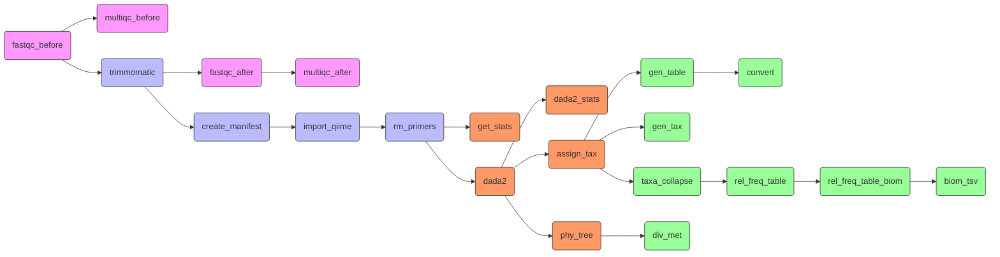

# Introduction
This section provides detailed explanation for building a complete workflow using Snakemake. For our workflow, we will do the following.

1. **Configuration file**: We will create a `config.yml` file which will contain information in `key`:`value` format about the project such as input directory of raw reads file and paths to reference databases.  Storing this information in a seperate configuration file allows us to reuse our workflow for different projects. 
2. **Write rules for each step**: We will write rules following Snakemake syntax for each step. These rules basically invovles specifying input file, output file, command to execute and other parameters. 
3. **Write `rule_all`**: By default Snakemake executes the first rule in the workflow. If the input files required for that rule are generated by other rules, those rules are also executed as well. To ensure that Snakemake executes all rules, we will write a `rule_all` that specifies all output files from all rules as inputs.

 **Don't worry if it does not make sense now** -- we will go through this in detail in the following sections.

## Workflow 
The figure below shows key steps in the workflow.

<html>

</html>

## References
 1. Köster, J., & Rahmann, S. (2012). Snakemake—a scalable bioinformatics workflow engine. Bioinformatics, 28(19), 2520-2522.